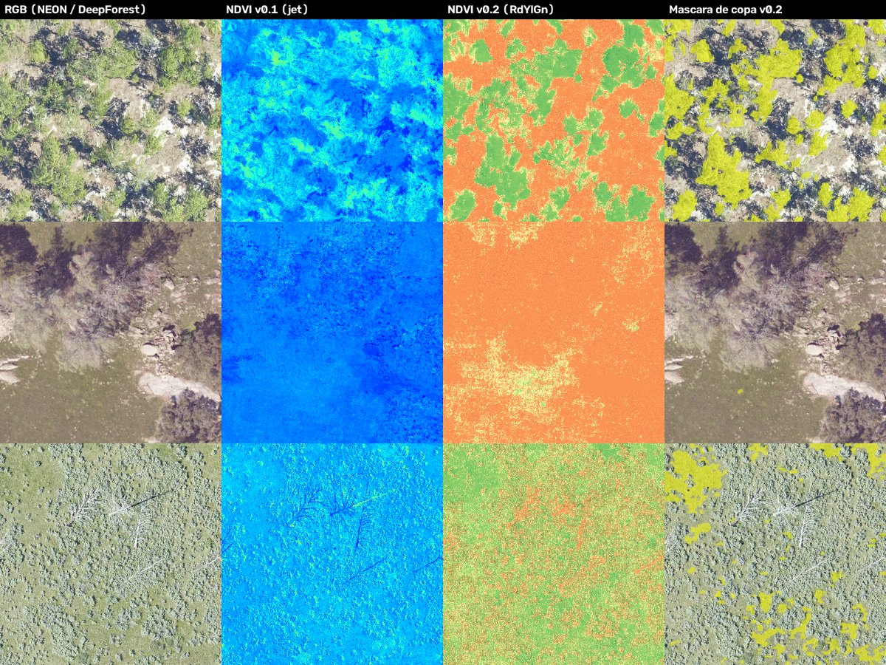

# AgriSpectralSynth

Generador de datos multiespectrales **sintéticos** a partir de imágenes RGB aéreas de árboles (p. ej. MillionTrees), emulando el sensor **DJI Mavic 3 Multispectral**. Produce bandas Verde / Rojo / Borde rojo / NIR (+ Azul de la cámara RGB), NDVI y otros índices, máscaras de copa y un `manifest.csv` con estadísticas por imagen — la base de datos espectral simulada sobre la que trabajará el agente de análisis.



## Instalación

```bash
python -m venv .venv
.venv\Scripts\activate            # Windows  (Linux/Mac: source .venv/bin/activate)
pip install -e ".[dev]"
```

`-e` instala el paquete en modo editable: ya no hace falta `sys.path.insert(...)` en los scripts.
Para descargar MillionTrees: `pip install -e ".[milliontrees]"` (ese paquete exige Python 3.10–3.12).

## Uso rápido

```bash
# Procesa data/raw -> data/processed con configs/default.yaml, en paralelo
python scripts/generate_synthetic.py

# Equivalente con el comando instalado
agrispectralsynth -c configs/default.yaml -i data/raw -o data/processed --workers 8

# Sólo 20 imágenes, regenerando aunque ya existan
agrispectralsynth -i data/raw -n 20 --overwrite

# Reproducir el resultado de v0.1 (fórmula y paleta antiguas)
agrispectralsynth -i data/raw -o data/processed_v01 --model legacy --cmap jet
```

Volver a ejecutar sólo procesa las imágenes nuevas o modificadas (las demás se saltan); `--overwrite` fuerza todo.

## Salidas

```
data/processed/
├── multispectral/_MS.tif     5 bandas uint16 (reflectancia × 10000): Blue, Green, Red, RedEdge, NIR
├── ndvi_raw/_NDVI.tif        NDVI float32
├── ndvi_visual/_NDVI.png     NDVI coloreado (RdYlGn, rango -0.2…1.0)
├── nir/_NIR.png              vista rápida del NIR
├── canopy_mask/_canopy.png   máscara de copa (0/255)
├── indices/<IDX>/_<IDX>.tif  GNDVI, NDRE, SAVI, MSAVI, EVI (opcional, --all-indices)
└── manifest.csv                   una fila por imagen: dataset, NDVI medio/p5/p50/p95, fracción de copa…
```

Si la entrada es un GeoTIFF georreferenciado, todas las salidas `.tif` conservan su CRS y transformación.

## Modelo espectral (v0.2, `unmixing`)

1. **Fracción de vegetación** `f` con ExG cromático `(2g − r − b)` en escala fija (no min-max por imagen, que hacía que una imagen sin árboles tuviera "100 % de vegetación" en su píxel más verde).
2. Se quita la gamma sRGB (la reflectancia es lineal; PNG/JPG no).
3. Mezcla de dos miembros extremos:
   - `Red = R · (1 − 0.6 f)` (absorción de clorofila en banda estrecha)
   - `NIR = f · 2.0 · G + (1 − f) · 1.25 · R` (meseta NIR vs. línea de suelo)
   - `RedEdge` entre Red y NIR.
4. Ruido de sensor dependiente de la señal (`σ = noise_std · √señal`), sembrado por nombre de archivo → reproducible.

Resultado típico: copas NDVI ≈ 0.6–0.8, suelo ≈ 0.1, sombras sin falsos positivos. La fórmula de v0.1 (`NIR = 1.6G − 0.4R + 0.1`) daba NDVI casi idéntico a árboles y suelo, y ~0.5 a las sombras. Es un modelo **empírico**; `spectral/prosail.py` queda reservado para el modelo físico (PROSAIL).

Todos los parámetros están en `configs/default.yaml`.

## Sensor

DJI Mavic 3M: Verde 560 ± 16 nm, Rojo 650 ± 16 nm, Borde rojo 730 ± 16 nm, NIR 860 ± 26 nm. **No tiene banda azul multiespectral**; el azul (para EVI) se toma de la cámara RGB.

## Tests

```bash
pytest
```

## Estructura

```
src/agrispectralsynth/
├── pipeline.py        procesamiento por lotes en paralelo
├── cli.py             línea de comandos
├── config.py          configuración (pydantic + YAML)
├── spectral/          modelo de reflectancia, librería espectral, materiales
├── indices/           NDVI, GNDVI, NDRE, SAVI, MSAVI, EVI
├── segmentation/      máscaras de vegetación y copas
├── sensors/           definición de sensores
├── datasets/          gestor de MillionTrees (descarga, polígonos, máscaras reales)
└── yolo/              etiquetas YOLO-seg desde máscaras
scripts/               generate_synthetic.py, download_milliontrees.py
configs/default.yaml
assets/samples/        imágenes de muestra para el README
```

`data/` está en `.gitignore`: las imágenes de entrada y los productos generados no se suben al repo. Las muestras para mostrar van en `assets/samples/`.

## Licencia

MIT
