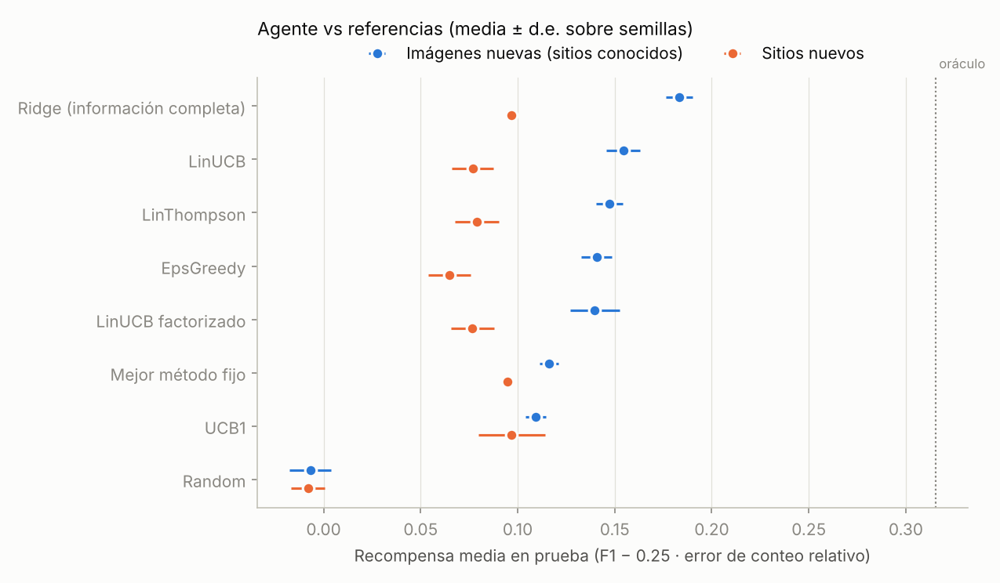
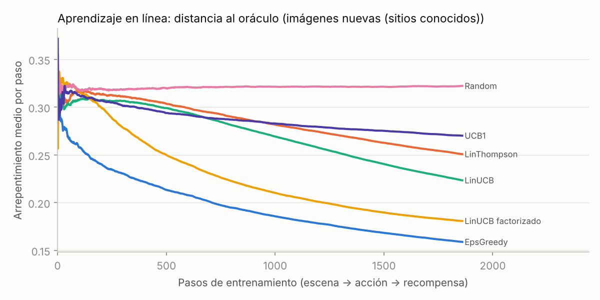
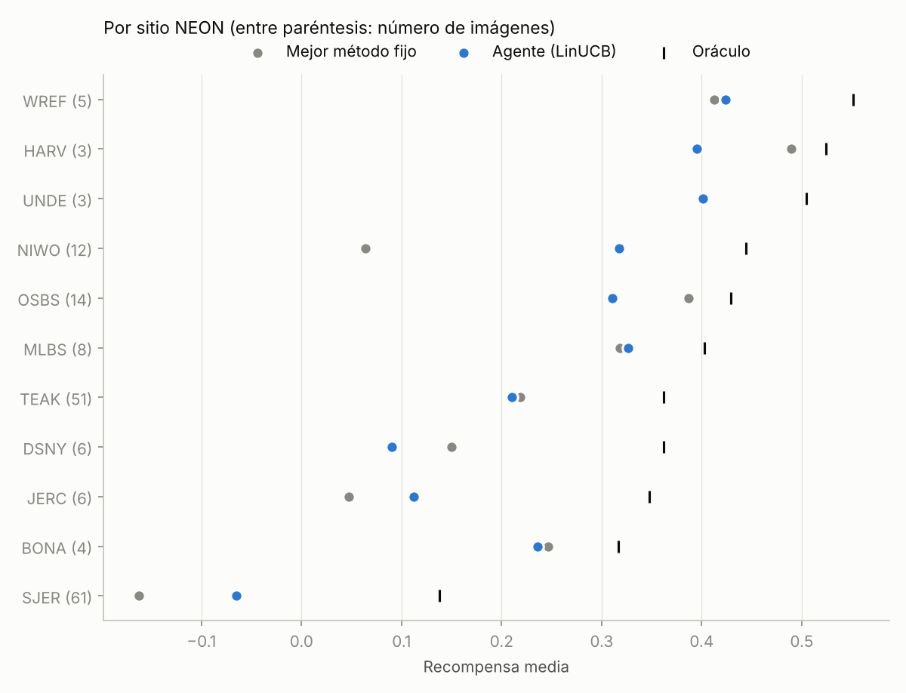
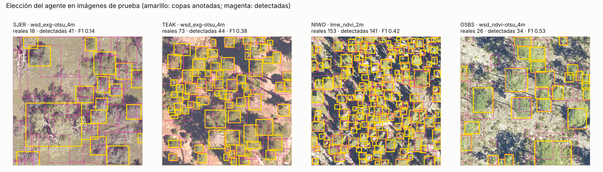

# Agente para delinear y contar copas

El agente decide, **para cada escena**, qué método de delineación de copas usar, y aprende de una **recompensa** calculada contra copas anotadas a mano. Este documento describe el planteamiento, el diseño de la recompensa, el protocolo experimental y los resultados obtenidos (versión 0.4).

> **Versión 0.5:** DeepForest como acción y datos hiperespectrales reales de NEON (conteo y validación del NDVI sintético) → [`neon_hiperespectral/README.md`](neon_hiperespectral/README.md).

## 1. Planteamiento

Detectar copas en una imagen es un problema supervisado ya resuelto razonablemente bien. Aprenderlo "desde cero" con recompensas sería lento y peor que un detector entrenado con etiquetas. Lo que **no** está resuelto es otra pregunta: ningún método funciona igual en todos los bosques. Un umbral de verdor que separa bien coníferas densas falla en una sabana de robles sobre pasto seco, y un tamaño de copa de 2 m divide en pedazos un roble de 8 m.

Por eso el agente es un **bandido contextual**, un tipo de aprendizaje por refuerzo de un solo paso:

```
   escena  ──►  contexto x (25 descriptores)  ──►  agente elige acción a (1 de 32 métodos)
                                                         │
   recompensa r = F1 − 0.25·error de conteo   ◄──  se ejecuta el método y se compara con las copas reales
```

Cada escena es independiente: elegir un método no cambia la escena siguiente. En ese caso el bandido contextual es la formulación correcta, mucho más eficiente en datos que un aprendizaje por refuerzo con estados y trayectorias.

## 2. Datos: verdad de campo

**NeonTreeEvaluation** (Weinstein et al., 2021): 194 imágenes RGB de NEON (400 × 400 px, 10 cm/píxel, 40 × 40 m) con **6,633 copas anotadas a mano**, en **22 sitios** de Estados Unidos (bosques boreales, coníferas de montaña, sabanas de robles, pinares del sureste, bosques templados caducifolios…). Licencia CC0. Es el benchmark de referencia para detección de copas en RGB aéreo.

```bash
python scripts/download_neontree_benchmark.py      # ~110 MB -> data/benchmarks/NeonTreeEvaluation
```

Distribución desigual: SJER (sabana de robles, 61 imágenes) y TEAK (coníferas de Sierra Nevada, 51) suman el 58 % de los datos. Esto pesa en los resultados (sección 7).

Para cada imagen se simulan los **4 drones** del motor espectral (Mavic 3M, Phantom 4M, RedEdge-MX, Sequoia+). Cada par imagen × sensor es un **contexto**: 776 en total.

## 3. Acciones (32 métodos)

Combinaciones de tres algoritmos clásicos, sin entrenamiento, con distintas señales, umbrales y tamaños de copa esperados:

| Componente | Opciones |
|---|---|
| **Algoritmo** | `cc` umbral + componentes conexas · `wsd` cuencas sobre la transformada de distancia (separa copas que se tocan) · `lmw` máximos locales de brillo como cimas + cuencas controladas por marcadores |
| **Señal** | `ndvi` NDVI sintético del sensor (cimas en su NIR) · `exg` exceso de verde cromático de la foto RGB · `dark` copas como objetos más oscuros que el fondo |
| **Umbral** | `fixed` constante (NDVI 0.45, ExG 0.06) · `otsu` calculado en cada imagen |
| **Tamaño de copa** | 2, 4 o 7 m de diámetro: fija la separación mínima entre cimas y el suavizado |

Nombre de cada acción: `algoritmo_señal[-otsu]_tamaño`, por ejemplo `wsd_exg-otsu_4m`. Las acciones que solo usan la RGB (`exg`, `dark`) dan el mismo resultado con cualquier sensor y se calculan una vez por imagen.

## 4. Contexto (lo que ve el agente)

25 descriptores baratos de la escena. **No se usan el nombre del sitio ni la ubicación**, para que el agente no pueda memorizar sitios:

- **Vegetación:** fracción de vegetación, NDVI (media, desviación, p90), ExG (media, desviación), umbral de Otsu del ExG.
- **Luz y sombra:** luminancia (media, desviación), fracción oscura, correlación verdor–oscuridad, textura (gradiente medio).
- **Escala:** granulometría, es decir, qué parte de la vegetación sobrevive a una apertura morfológica de 2, 4 y 7 m.
- **"Sondeo" de objetos:** número de manchas verdes y oscuras por hectárea, su área mediana y su compacidad.
- **Sensor** (one-hot).

Se estandarizan con media y desviación del conjunto de entrenamiento.

## 5. Recompensa

### Emparejamiento con la verdad de campo

Una copa detectada es **verdadero positivo** si puede emparejarse uno a uno con una copa anotada con **IoU ≥ 0.4** (asignación húngara que maximiza el IoU), el criterio del benchmark. De ahí salen precisión, recall y **F1**. El **error de conteo relativo** es |detectadas − reales| / reales.

### Fórmula

```
r = F1 − 0.25 · min(1, error de conteo relativo) − 0 · segundos
```

- **F1** premia encontrar las copas correctas en el lugar correcto.
- **El término de conteo** agrega lo que importa en un inventario forestal: cuántos árboles hay. El F1 por sí solo puede ser mediocre con el conteo correcto, o al revés. Se trunca en 1 para que una imagen con 1 árbol y 30 detecciones no domine el promedio.
- **El término de tiempo** permite castigar métodos lentos al desplegar. Está en 0 para que los resultados no dependan de la máquina.

Los pesos se cambian con `--count-weight` y `--time-weight` al construir la tabla de recompensas.

### Tabla de recompensas

Como todas las acciones se pueden evaluar fuera de línea contra la verdad de campo, se calcula **una sola vez** la matriz completa: 776 contextos × 32 acciones = 24,832 recompensas, unos 3 minutos con 2 núcleos. Los experimentos *reproducen* esa tabla. En cada paso el agente solo ve la recompensa de la acción que eligió, pero el resto queda disponible para medir el arrepentimiento y el oráculo. Es el protocolo estándar de evaluación fuera de línea para bandidos, y hace todo exactamente reproducible.

## 6. Políticas comparadas

| Política | Qué es |
|---|---|
| **LinUCB** | Un modelo lineal por acción más optimismo ante la incertidumbre (Li et al., 2010) |
| **LinThompson** | Muestreo de Thompson con regresión lineal bayesiana (Agrawal y Goyal, 2013) |
| **ε-greedy** | Regresión ridge más exploración aleatoria decreciente |
| **LinUCB factorizado** | Comparte parámetros entre acciones según sus componentes (señal, algoritmo, tamaño, umbral) |
| **UCB1** | Bandido *sin* contexto (Auer et al., 2002): converge al mejor método único |
| **Mejor método fijo** | El método con mejor recompensa media en entrenamiento, usado siempre. Es la práctica habitual de "calibrar un método una vez" |
| **Ridge (información completa)** | *No* es un bandido: en entrenamiento ve la recompensa de las 32 acciones. Es la referencia superior de una política lineal |
| **Oráculo** | La mejor acción de cada escena, mirando la respuesta. Es la cota superior |

## 7. Protocolo y resultados

Validación cruzada de 5 grupos, **10 semillas**. El entrenamiento es en línea (3 pasadas por los contextos de entrenamiento en orden aleatorio, viendo solo la recompensa elegida) y la evaluación usa la política sin exploración sobre el grupo de prueba. Dos protocolos:

- **Imágenes nuevas (sitios conocidos):** grupos al azar por imagen; los 4 sensores de una imagen quedan siempre juntos.
- **Sitios nuevos:** cada grupo de prueba contiene sitios NEON completos que nunca se vieron en entrenamiento. Mide la generalización a bosques nuevos.



| Política | Imágenes nuevas: recompensa | F1 | Error de inventario | Sitios nuevos: recompensa | F1 | Error de inventario |
|---|---|---|---|---|---|---|
| Oráculo (cota) | 0.315 | 0.367 | −1.6 % | 0.315 | 0.367 | +4.2 % |
| Ridge (información completa) | 0.183 ± 0.007 | 0.291 | +5.2 % | 0.097 | 0.245 | +58.5 % |
| **LinUCB** | **0.154 ± 0.009** | 0.272 | **+1.3 %** | 0.077 ± 0.011 | 0.227 | +63.5 % |
| LinThompson | 0.147 ± 0.007 | 0.266 | +0.3 % | 0.079 ± 0.011 | 0.225 | +45.8 % |
| ε-greedy | 0.141 ± 0.008 | 0.262 | +1.4 % | 0.065 ± 0.011 | 0.211 | +38.9 % |
| LinUCB factorizado | 0.140 ± 0.013 | 0.262 | +2.2 % | 0.077 ± 0.011 | 0.224 | +42.6 % |
| Mejor método fijo | 0.116 ± 0.005 | 0.266 | **+31.2 %** | 0.095 | 0.249 | **+158 %** |
| UCB1 (sin contexto) | 0.109 ± 0.005 | 0.251 | +5.0 % | 0.097 ± 0.017 | 0.250 | +147 % |
| Aleatorio | −0.007 | 0.162 | +23.0 % | −0.008 | 0.161 | +78.2 % |

*Error de inventario = (árboles detectados − reales) / reales, sumado sobre todas las imágenes de prueba. Fuente: [`resultados_v0.4.csv`](resultados_v0.4.csv).*

### Lectura

1. **En sitios conocidos el agente aprende y supera al mejor método fijo.** LinUCB cierra el 19 % de la brecha entre el mejor método fijo y el oráculo, con F1 similar. Sobre todo, corrige el conteo: el error de inventario baja de **+31 % a +1.3 %**. El mejor método fijo sobrecuenta mucho en las escenas donde no le corresponde.
2. **En sitios nuevos no supera al mejor método fijo en recompensa** (0.077 vs 0.095), pero **sobrecuenta mucho menos** (+46 a +64 % frente a +158 %). Lo aprendido sobre qué método conviene en qué escena no se transfiere bien a ecosistemas que nunca vio. El caso extremo es SJER: es el 31 % de los datos y la única sabana; cuando queda fuera del entrenamiento no hay nada parecido de dónde aprender.
3. **El cuello de botella no es la exploración.** Incluso el modelo con información completa (Ridge) queda empatado con el mejor método fijo en sitios nuevos. Lo que limita son los descriptores y la cantidad de sitios distintos (22). Antes de mirar el conjunto de prueba se probaron tres mejoras con justificación previa (descriptores de "sondeo" de objetos, menos acciones, modelo factorizado), y ninguna resolvió la generalización entre sitios. Se reportan todas.
4. **Aprendizaje:** durante el entrenamiento, ε-greedy y LinUCB factorizado acumulan menos arrepentimiento porque exploran menos. LinUCB explora más y termina con la mejor política en prueba. El bandido sin contexto (UCB1) se queda cerca del mejor método único.



### Qué aprende el agente



En los sitios con más datos, el método que el agente elige coincide con el que el oráculo indica ([`elecciones_por_sitio_v0.4.csv`](elecciones_por_sitio_v0.4.csv)):

| Sitio | Tipo de bosque | Elección más frecuente del agente | Más frecuente del oráculo |
|---|---|---|---|
| SJER | sabana de robles, pasto seco | `wsd_dark_7m` (44 %): copas grandes y oscuras | `wsd_dark_7m` (37 %) |
| TEAK | coníferas sobre suelo claro | `wsd_exg-otsu_4m` (51 %) | `wsd_exg-otsu_4m` (32 %) |
| OSBS | pinar abierto | `wsd_exg-otsu_4m` (28 %) | `wsd_exg-otsu_4m` (39 %) |
| NIWO | coníferas subalpinas densas | copas de 2 m (`wsd_exg-otsu_2m`, `wsd_ndvi_2m`) | copas de 2 m |
| WREF | coníferas altas | `lmw_exg-otsu_4m` (43 %) | `lmw_exg-otsu_4m` (60 %) |

Es decir, el agente redescubre reglas que un experto aplicaría: en la sabana busca objetos oscuros y grandes, en coníferas densas copas pequeñas, y donde la iluminación varía usa umbrales adaptativos.



### ¿Aporta el NDVI sintético?

Para **contar** árboles, poco. Esto es importante para el artículo:

| Acciones disponibles | Recompensa del oráculo |
|---|---|
| Todas (RGB + NDVI sintético) | 0.315 |
| Solo RGB (`exg`, `dark`) | 0.296 |
| Solo NDVI sintético | 0.228 |

El NDVI sintético se deriva de la propia foto RGB y de la librería espectral, así que no agrega información sobre **dónde** están los árboles. Por eso el sensor simulado no cambia el resultado: el oráculo de las acciones NDVI va de 0.224 a 0.231 entre los 4 drones. Además, en coníferas oscuras el motor asigna NDVI de suelo, porque su verdor en la foto es débil (limitación documentada del simulador). El valor de los datos multiespectrales sintéticos está en otras preguntas: transferencia a sensores reales, estado de salud de las copas y efecto de escala.

## 8. Limitaciones y siguientes pasos

- **Métodos clásicos.** F1 de 0.25–0.29 frente a 0.37 del oráculo. *Resuelto en la v0.5:* DeepForest como acción (F1 0.69 en sitios nuevos) y término de tiempo activo; ver [`neon_hiperespectral/`](neon_hiperespectral/README.md).
- **Pocos sitios distintos (22) para generalizar.** MillionTrees tiene muchos más ecosistemas. El cargador de anotaciones ya lee sus polígonos WKT.
- **Recompensa con cajas.** Las anotaciones del benchmark son rectángulos; con polígonos (MillionTrees) se puede pasar a IoU de máscara.
- **Validación del NIR sintético.** *Hecho en la v0.5* con el hiperespectral NEON de las mismas parcelas: r = 0.67 píxel a píxel y sesgo de −0.26 en NDVI ([`neon_hiperespectral/`](neon_hiperespectral/README.md#2-validación-del-simulador-ndvi-sintético-frente-a-ndvi-real)).
- **Políticas no lineales** (bosques aleatorios, redes pequeñas) con la misma recompensa, si se dispone de más sitios.

## 9. Reproducir

```bash
pip install -e ".[dev]"
python scripts/download_neontree_benchmark.py
B=data/benchmarks/NeonTreeEvaluation

# 1. Tabla de recompensas (todas las acciones en todas las escenas) ~3 min
agrispectralsynth-agent rewards --images $B/evaluation/RGB --annotations $B/annotations --out results/agent

# 2. Validación cruzada de las políticas (ambos protocolos, 10 semillas) + figuras
agrispectralsynth-agent evaluate --table results/agent --seeds 10 --images $B/evaluation/RGB --annotations $B/annotations

# 3. Entrenar el agente final con todos los datos y usarlo en imágenes nuevas
agrispectralsynth-agent train --table results/agent --out results/agent/agent.json
agrispectralsynth-agent apply --agent results/agent/agent.json --input data/raw --output results/conteo
```

`apply` escribe, por imagen, el método elegido, el número de árboles, árboles por hectárea y las cajas de cada copa (`boxes/<imagen>.csv`).

## Referencias

- Weinstein, B. G. et al. (2021). A benchmark dataset for canopy crown detection and delineation in co-registered airborne RGB, LiDAR and hyperspectral imagery from the National Ecological Observation Network. *PLOS Computational Biology* 17(7): e1009180. [PMC8282040](https://www.ncbi.nlm.nih.gov/pmc/articles/PMC8282040/) · datos: [weecology/NeonTreeEvaluation](https://github.com/weecology/NeonTreeEvaluation) (CC0)
- Li, L., Chu, W., Langford, J., Schapire, R. E. (2010). A contextual-bandit approach to personalized news article recommendation. *WWW 2010*.
- Agrawal, S., Goyal, N. (2013). Thompson sampling for contextual bandits with linear payoffs. *ICML 2013*.
- Auer, P., Cesa-Bianchi, N., Fischer, P. (2002). Finite-time analysis of the multiarmed bandit problem. *Machine Learning* 47: 235–256.
- Otsu, N. (1979). A threshold selection method from gray-level histograms. *IEEE Transactions on Systems, Man, and Cybernetics* 9(1): 62–66.
