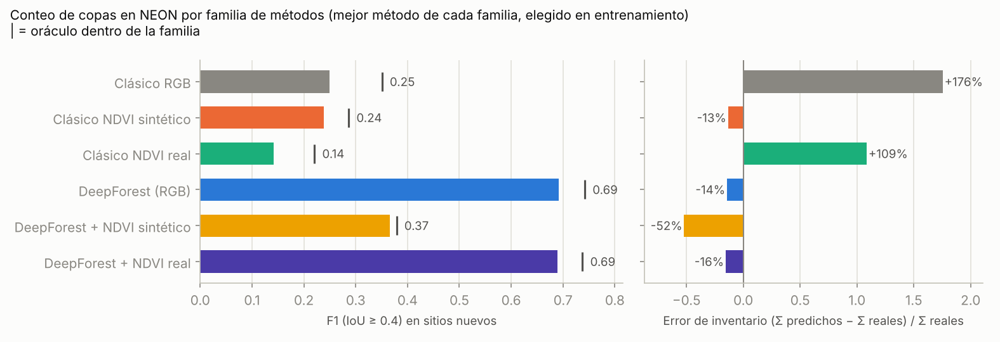
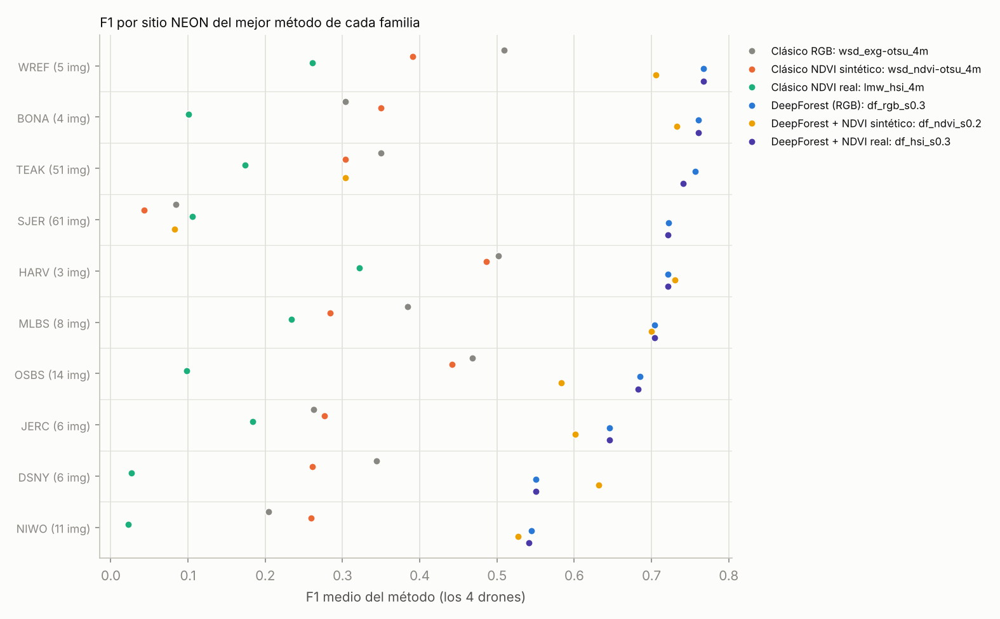
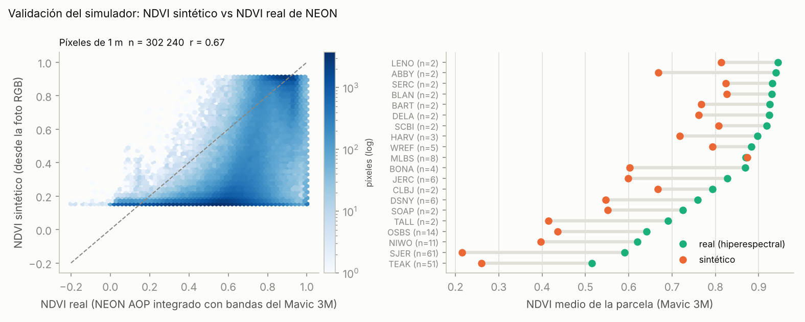
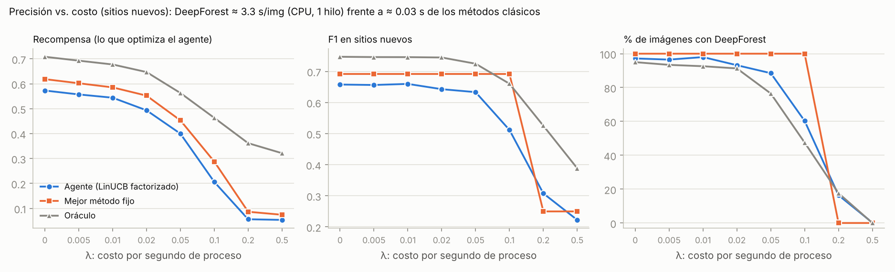

# Conteo de copas en NEON: DeepForest e hiperespectral real

Resultados de la versión 0.5 del agente sobre **NeonTreeEvaluation** (Weinstein et al., 2021). Hay dos novedades respecto a la v0.4 ([`../README.md`](../README.md)):

1. **DeepForest como acción.** Es un detector RetinaNet entrenado con imágenes RGB de NEON. El agente puede elegirlo o no. Es mucho más preciso que los métodos clásicos, pero ~100 veces más lento en CPU, y eso le da sentido al término de tiempo de la recompensa.
2. **Datos hiperespectrales reales de NEON** de las mismas parcelas: 426 bandas a 1 m, el producto de reflectancia AOP. Cada píxel se integra con las curvas de respuesta espectral de los 4 drones simulados, igual que se hace con el espectro sintético. Así se obtiene, sin vuelos propios, **lo que cada drone habría medido de verdad**. Sirve para tres cosas:
   - acciones nuevas sobre el NDVI **real**;
   - filtrar las detecciones de DeepForest por NDVI real o sintético;
   - **validar el NDVI sintético** píxel a píxel.

Datos: 189 parcelas de 20 sitios NEON con anotación de copas e hiperespectral (6 262 árboles; UNDE y ONAQ quedan fuera), × 4 drones = 756 contextos. Se tomaron 190 parcelas con hiperespectral; la `ONAQ_021_2019` se excluye porque su cubo trae 425 bandas en lugar de 426. Son 58 acciones y 43 848 evaluaciones en total. La tabla de recompensas tarda 12 min en una CPU de 2 núcleos.

## Acciones nuevas

| Familia | Acciones | Qué hace |
|---|---|---|
| Clásico RGB | 16 (`*_exg*`, `*_dark*`) | Umbral + componentes conexas / watershed sobre el verdor o la oscuridad de la foto (v0.4) |
| Clásico NDVI sintético | 16 (`*_ndvi*`) | Lo mismo sobre el NDVI simulado del drone (v0.4) |
| **Clásico NDVI real** | 14 (`*_hsi*`) | Lo mismo sobre el NDVI **real**: cubo NEON integrado con las bandas del drone y remuestreado de 1 m a 10 cm |
| **DeepForest** | 4 (`df_rgb_s0.1` … `s0.4`) | DeepForest 1.0.0 (`NEON.pt`) con un puntaje mínimo de 0.1 a 0.4 |
| **DeepForest + NDVI sintético** | 4 (`df_ndvi_*`) | Descarta las cajas cuya mediana de NDVI sintético es < 0.3 |
| **DeepForest + NDVI real** | 4 (`df_hsi_*`) | Descarta las cajas cuya mediana de NDVI real es < 0.3 |

DeepForest corre una sola vez por imagen. Todas sus acciones pagan ese tiempo: ≈ 3.3 s por imagen de 400 × 400 px en CPU con un hilo, frente a ≈ 0.03 s de los métodos clásicos.

## 1. Resultado principal: conteo por familia de métodos

Para cada familia se elige su mejor método en los grupos de **entrenamiento** y se evalúa en **sitios nuevos** (validación cruzada agrupada por sitio, 5 grupos).



| Familia | Método elegido | F1 sitios nuevos | F1 imágenes nuevas | Error de inventario (sitios nuevos) | s/img |
|---|---|---|---|---|---|
| Clásico RGB | `wsd_exg-otsu_4m` | 0.25 | 0.27 | +176 % | 0.04 |
| Clásico NDVI sintético | `wsd_ndvi-otsu_4m` | 0.24 | 0.24 | −13 % | 0.03 |
| Clásico NDVI real | `lmw_hsi_4m` | 0.14 | 0.14 | +109 % | 0.03 |
| **DeepForest (RGB)** | `df_rgb_s0.3` | **0.69** | **0.71** | −14 % | 3.3 |
| DeepForest + NDVI sintético | `df_ndvi_s0.2` | 0.37 | 0.36 | **−52 %** | 3.3 |
| DeepForest + NDVI real | `df_hsi_s0.3` | 0.69 | 0.70 | −16 % | 3.3 |

*Fuente: [`familias.csv`](familias.csv). Error de inventario = (Σ árboles detectados − Σ reales) / Σ reales.*

### Lectura

1. **DeepForest casi triplica el F1 de los métodos clásicos**: 0.69 frente a 0.25. Con puntaje ≥ 0.3 tiene precisión 0.79 y exhaustividad 0.67. Subcuenta un 14 %, mientras que el mejor clásico sobrecuenta un 176 % en sitios que no vio. Es el nuevo punto de referencia. Hay que tener en cuenta que `NEON.pt` se entrenó con imágenes NEON, aunque de otras teselas distintas a las de evaluación, que es el uso previsto del benchmark.
2. **El NDVI real a 1 m no sirve para delinear copas** (F1 0.14, peor que el RGB). Hay dos razones:
   - **Resolución.** Copas de 2–7 m son 2–7 píxeles hiperespectrales: el NDVI real no tiene bordes entre copas vecinas.
   - **Contraste.** En la sabana de SJER el pasto verde tiene el mismo NDVI que los robles.

   Se comprobó visualmente que el cubo y la foto están bien co-registrados (mismos límites). El hiperespectral real aporta **qué es** cada píxel, no **dónde termina** cada copa.
3. **Filtrar DeepForest con NDVI real casi no cambia nada**: elimina solo el 1.4 % de las detecciones. Los errores de DeepForest no están sobre suelo desnudo sino sobre vegetación: sotobosque, arbustos, copas partidas o fusionadas. Ahí el NDVI no discrimina.
4. **Filtrar DeepForest con NDVI sintético es dañino**: el F1 baja de 0.69 a 0.37 y se pierde la mitad de los árboles. En SJER el F1 pasa de 0.72 a 0.08 y en TEAK de 0.76 a 0.30 ([`sitios.csv`](sitios.csv)). El NDVI sintético subestima la vegetación, como muestra la sección 2, y el umbral de 0.3 que tiene sentido para NDVI real elimina copas verdaderas. **No se deben aplicar a datos sintéticos los umbrales absolutos de NDVI calibrados con datos reales.**



## 2. Validación del simulador: NDVI sintético frente a NDVI real

Para cada parcela y drone, el NDVI sintético (generado desde la foto RGB) se agrega a 1 m y se compara con el real. Son 302 240 pares de píxeles por drone. Fuente: [`validacion_ndvi.csv`](validacion_ndvi.csv) y [`validacion_ndvi_sensores.csv`](validacion_ndvi_sensores.csv).



| Drone | NDVI real | NDVI sintético | Sesgo | RMSE | r (píxeles) | Rojo real / sintético | NIR real / sintético |
|---|---|---|---|---|---|---|---|
| Mavic 3M | 0.65 | 0.39 | −0.26 | 0.32 | 0.67 | 0.055 / 0.187 | 0.25 / 0.40 |
| Phantom 4M | 0.64 | 0.38 | −0.26 | 0.32 | 0.68 | 0.055 / 0.187 | 0.24 / 0.39 |
| RedEdge-MX | 0.65 | 0.37 | −0.28 | 0.34 | 0.68 | 0.053 / 0.193 | 0.24 / 0.39 |
| Sequoia+ | 0.62 | 0.35 | −0.27 | 0.33 | 0.68 | 0.055 / 0.191 | 0.23 / 0.37 |

### Lectura

1. **El patrón espacial se conserva, el nivel absoluto no.** La correlación píxel a píxel es r = 0.67, pero el NDVI sintético está **0.26 por debajo** del real en promedio.
2. **El error es el mismo para los 4 drones.** No viene de las bandas simuladas (las curvas de respuesta y la integración se validan bien) sino del paso anterior: la **fracción de vegetación** que el motor deduce de la foto.
3. **El error tiene una causa concreta.** El hexbin muestra un "piso" en NDVI sintético ≈ 0.15, el NDVI del suelo de la librería, para muchos píxeles cuyo NDVI real es 0.4–0.9. Son píxeles de vegetación que el motor trató como suelo:
   - pasto seco o verde-amarillento de SJER, con sesgo −0.38;
   - copas en sombra y coníferas oscuras de TEAK y NIWO, con sesgo −0.25 y −0.22.

   En el bosque caducifolio denso de MLBS el sesgo es nulo (+0.004).
4. **El rojo sintético es 3.4 veces el real** (0.19 frente a 0.055). Cerca de la mitad de los píxeles reciben espectro de suelo, que es brillante en el rojo.

Para el artículo esto es un resultado útil en sí mismo. La base sintética reproduce **dónde** hay más o menos vegetación, pero **sesga a la baja el NDVI absoluto** en escenas secas o sombreadas. El siguiente paso natural ya es posible con estos datos: **calibrar la fracción de vegetación del motor con los 300 k pares de píxeles reales**, de modo que el NDVI sintético quede validado contra NEON.

## 3. El agente con DeepForest disponible

Se evaluaron LinUCB y LinUCB factorizado con distintos conjuntos de acciones, en validación cruzada de 5 grupos y 5 semillas. Fuente: [`conjuntos_acciones.csv`](conjuntos_acciones.csv).

| Acciones | Política | Recompensa (sitios nuevos) | F1 (sitios nuevos) | Recompensa (imágenes nuevas) | F1 (imágenes nuevas) |
|---|---|---|---|---|---|
| Clásicas (v0.4, 32) | Mejor método fijo | 0.094 | 0.25 | 0.110 | 0.26 |
| | LinUCB | 0.074 | 0.22 | **0.146** | 0.27 |
| | Oráculo | 0.312 | 0.36 | 0.312 | 0.36 |
| + NDVI real (46) | Mejor método fijo | 0.094 | 0.25 | 0.110 | 0.26 |
| | LinUCB factorizado | 0.083 | 0.23 | **0.153** | 0.28 |
| | Oráculo | 0.336 | 0.39 | 0.336 | 0.39 |
| + DeepForest (40) | **Mejor método fijo** (`df_rgb_s0.3`) | **0.619** | **0.69** | **0.639** | **0.71** |
| | LinUCB factorizado | 0.585 | 0.67 | 0.615 | 0.69 |
| | Oráculo | 0.706 | 0.75 | 0.706 | 0.75 |
| Todas (58) | Mejor método fijo | 0.619 | 0.69 | 0.639 | 0.71 |
| | LinUCB | 0.580 | 0.66 | 0.608 | 0.68 |
| | Oráculo | 0.708 | 0.75 | 0.708 | 0.75 |

- El NDVI real sube el techo del oráculo (0.312 → 0.336), pero el agente lo aprovecha poco. Solo mejora en sitios conocidos (0.146 → 0.153).
- Si DeepForest no cuesta nada, **siempre conviene usarlo**: el agente lo elige en el 97 % de las escenas. Aun así no supera a "usar siempre DeepForest con puntaje 0.3". El margen hasta el oráculo (0.62 → 0.71) está en elegir el **umbral de puntaje** de cada escena, y los descriptores actuales no lo predicen.

## 4. Precisión frente a costo

La recompensa es F1 − 0.25 · error de conteo − **λ · segundos**. Se varía λ sin recalcular nada, porque `load_reward_table(..., weights=...)` recompone la recompensa con las métricas guardadas. Evaluación en sitios nuevos. Fuente: [`costo_tiempo.csv`](costo_tiempo.csv).



| λ (por s) | Oráculo: F1 · % DeepForest · s/img | Mejor fijo: F1 · % DF | Agente: F1 · % DF · s/img |
|---|---|---|---|
| 0 | 0.75 · 95 % · 3.1 | 0.69 · 100 % | 0.66 · 97 % · 3.2 |
| 0.05 | 0.72 · 76 % · 2.5 | 0.69 · 100 % | 0.63 · 89 % · 2.9 |
| 0.1 | **0.66 · 48 % · 1.6** | 0.69 · 100 % | 0.51 · 60 % · 2.0 |
| 0.2 | 0.53 · 18 % · 0.6 | 0.25 · 0 % | 0.31 · 16 % · 0.6 |
| 0.5 | 0.39 · 0 % | 0.25 · 0 % | 0.22 · 0 % |

### Lectura

- **El margen para un agente es grande.** Con λ = 0.1, el oráculo usa DeepForest solo en la mitad de las imágenes y conserva un F1 de 0.66 con la mitad del tiempo. Es decir, en muchas escenas un método clásico basta.
- **El agente aprende la dirección correcta, pero no lo bastante bien.** Usa DeepForest cada vez menos a medida que sube λ y, con λ = 0.2, logra un F1 mayor que el mejor método fijo (0.31 frente a 0.25) usando DeepForest en el 16 % de las imágenes. Sin embargo, en **recompensa** no supera al mejor método fijo con ningún λ: sus elecciones de *cuándo* pagar DeepForest son todavía imprecisas.
- **Interpretación.** Los descriptores de contexto (verdor, textura, NDVI sintético, tamaño de objetos) predicen mal en qué escenas falla el método clásico. Es la misma conclusión que en la v0.4 para la generalización entre sitios, ahora con un caso de uso concreto: **ahorrar cómputo**.
- El tiempo de DeepForest se midió en CPU con un hilo. En GPU es uno o dos órdenes de magnitud menor, así que el λ relevante depende del despliegue: dron con cómputo a bordo, portátil de campo o servidor.

## 5. Conclusiones para el artículo

1. Con datos NEON reales, **un detector entrenado (DeepForest) supera ampliamente a los métodos clásicos** sobre índices espectrales, sean sintéticos o reales: F1 0.69 frente a ≤ 0.25 en sitios nuevos.
2. **El hiperespectral real a 1 m no mejora el conteo**: ni como señal de delineación ni como filtro de DeepForest. Su valor está en caracterizar las copas (estado, especie), no en encontrarlas.
3. **El NDVI sintético reproduce el patrón espacial del real (r = 0.67) con un sesgo de −0.26.** El sesgo viene de la fracción de vegetación deducida de la foto y es igual para los 4 drones. Por eso no conviene usar el NDVI sintético con umbrales absolutos: como filtro, borra la mitad de los árboles.
4. **El agente aprende a dosificar DeepForest según el costo**, pero no supera al mejor método fijo. El oráculo muestra que se podría mantener casi toda la precisión con la mitad del cómputo, si se encuentra un contexto que lo prediga.

## Siguientes pasos

- **Calibrar el motor espectral con NEON**: la fracción de vegetación y el brillo por clase, usando `hsi_pixels.npz`. Luego, repetir la validación por sitio. Es el paso que más valor le da a la base sintética.
- **Contexto barato que prediga el desempeño de DeepForest**: por ejemplo, DeepForest sobre una miniatura submuestreada (una fracción del costo), la densidad de bordes o el tamaño de las copas estimado.
- **Umbral de puntaje adaptativo**: el 0.05 de F1 que separa al mejor fijo del oráculo cuando λ = 0 está ahí.
- **Hiperespectral para clasificar copas**, no para encontrarlas: estado sanitario y especie a partir de las cajas de DeepForest.

## Reproducir

```bash
pip install -e ".[deepforest]"
agrispectralsynth-agent download-deepforest                                   # pesos DeepForest 1.0.0 (~130 MB)
python scripts/download_neontree_benchmark.py --with-hyperspectral            # +265 MB
B=data/benchmarks/NeonTreeEvaluation

agrispectralsynth-agent rewards --images $B/evaluation/RGB --annotations $B/annotations \
    --out results/agent_neon --deepforest --hsi-dir $B/evaluation/Hyperspectral    # ~12 min (2 núcleos)
python scripts/experimento_neon_hiperespectral.py --table results/agent_neon --out docs/agente/neon_hiperespectral

# El agente con costo de tiempo y un subconjunto de acciones
agrispectralsynth-agent evaluate --table results/agent_neon --time-weight 0.1 --actions classical,df
```

## Referencias

- Weinstein, B. G. et al. (2019). Individual tree-crown detection in RGB imagery using semi-supervised deep learning neural networks. *Remote Sensing* 11(11): 1309.
- Weinstein, B. G. et al. (2020). DeepForest: A Python package for RGB deep learning tree crown delineation. *Methods in Ecology and Evolution* 11(12): 1743–1751. Pesos `NEON.pt` de la versión 1.0.0: [weecology/DeepForest](https://github.com/weecology/DeepForest/releases/tag/1.0.0) (MIT).
- Weinstein, B. G. et al. (2021). A benchmark dataset for canopy crown detection and delineation in co-registered airborne RGB, LiDAR and hyperspectral imagery from the National Ecological Observation Network. *PLOS Computational Biology* 17(7): e1009180. Datos: [weecology/NeonTreeEvaluation](https://github.com/weecology/NeonTreeEvaluation) (CC0).
- NEON (National Ecological Observatory Network). Spectrometer orthorectified surface directional reflectance – mosaic (DP3.30006.001).
