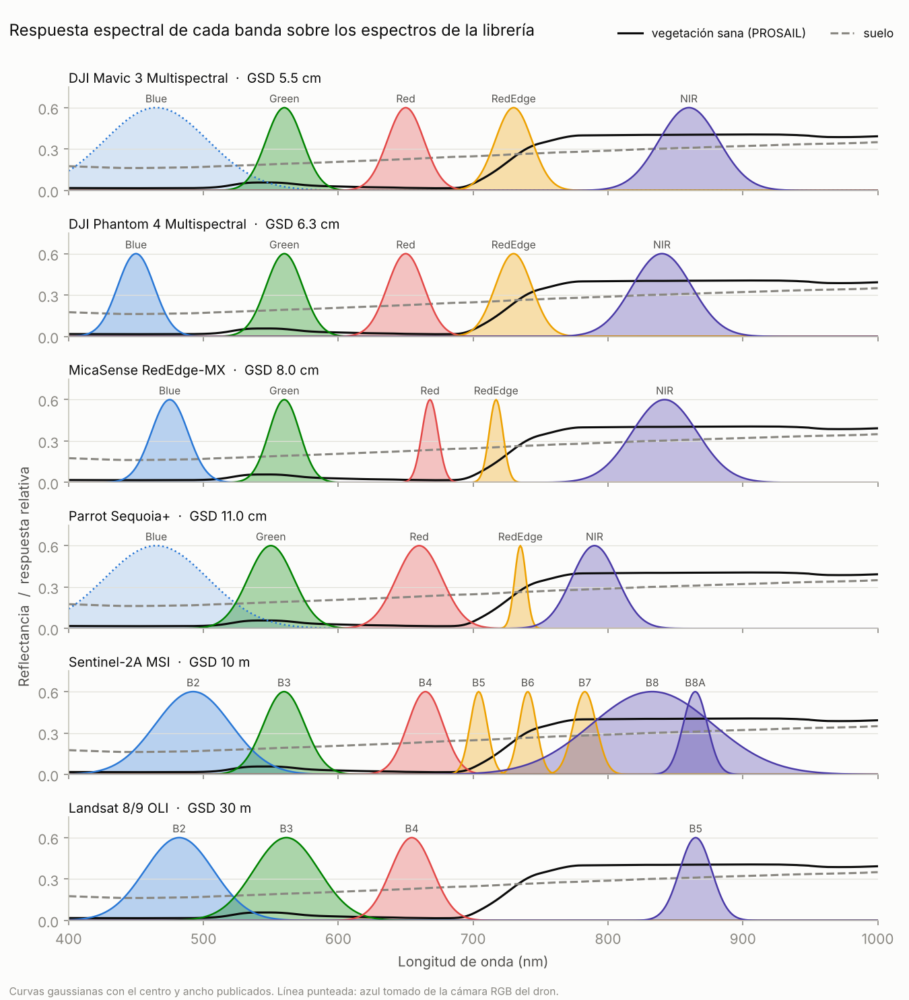
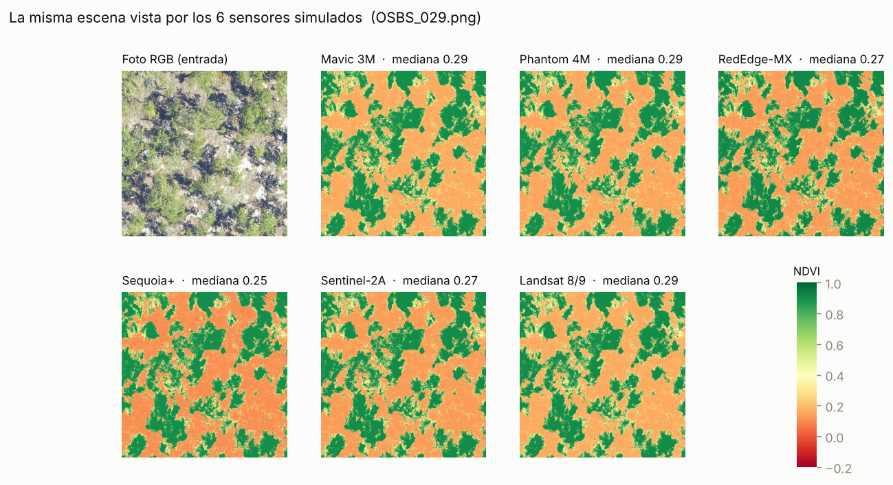
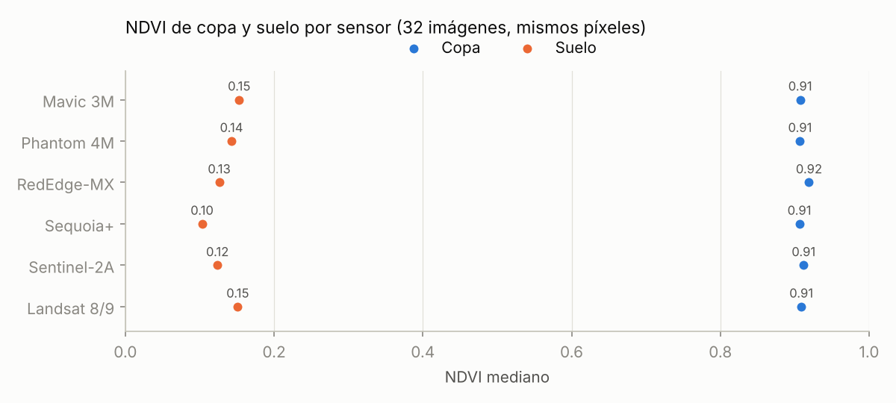
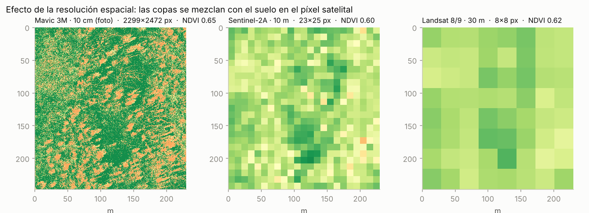

# Sensores simulados

Esta carpeta describe **cómo observa cada instrumento**: qué bandas tiene, dónde está centrada cada una, qué tan ancha es y qué resolución espacial tiene. No contiene código ni imágenes de entrada; el motor espectral (`src/agrispectralsynth/spectral/engine.py`) combina estas definiciones con los espectros de [`spectral_library/`](../spectral_library/) para producir las bandas sintéticas.

```
sensors/
├── README.md              este documento
├── rgb_camera.yaml        cámara RGB que tomó las fotos de entrada (supuesto)
├── drones/
│   ├── dji_mavic3m.yaml
│   ├── dji_phantom4m.yaml
│   ├── micasense_rededge_mx.yaml
│   └── parrot_sequoia_plus.yaml
├── satellites/
│   ├── sentinel2a_msi.yaml
│   └── landsat_oli.yaml
├── srf/                   curvas de respuesta medidas (opcional, ver srf/README.md)
└── figuras/               figuras de este documento (scripts/make_sensor_figures.py)
```

**Separación de responsabilidades.** `spectral_library/` describe lo que *refleja la superficie* (vegetación, suelo…), independientemente de quién la mire. `sensors/` describe *cómo la ve cada instrumento*. Una banda simulada es el cruce de ambas:

> espectro del material × respuesta espectral de la banda → valor de la banda

---

## 1. Cómo se simula un sensor

Una foto RGB no tiene información del infrarrojo. El motor no "inventa" el NIR píxel por píxel con una fórmula sobre R, G y B. Lo deduce de **qué material** hay en el píxel y de **cómo refleja ese material** en todo el espectro.

### Paso 1. Qué hay en cada píxel

A partir de la foto se estima la **fracción de vegetación** `f` (0 = suelo, 1 = vegetación) con el exceso de verde cromático:

```
ExG = (2G − R − B) / (R + G + B)        f = suavizado de ExG entre 0.02 y 0.10
```

Se usa la forma cromática (dividida por el brillo) para que una zona oscura no cambie de clase solo por estar en sombra. Los píxeles muy oscuros, donde el color no es confiable, se tratan como fondo.

### Paso 2. Espectro continuo del píxel (400–1000 nm, cada 1 nm)

Cada píxel es una mezcla lineal de dos espectros de la librería, multiplicada por un brillo relativo `b`:

```
ρ(λ) = b · [ f · E_veg(λ) + (1 − f) · E_suelo(λ) ]
```

- `E_veg`: espectro de vegetación generado con **PROSAIL** (PROSPECT-D + 4SAIL). Por defecto es `vegetation/healthy`; también hay `stressed`, `dry` y `dead`.
- `E_suelo`: espectro de suelo (`soil/soil_mixed`).
- `b`: **brillo relativo**. Las fotos aéreas (NEON, NAIP, JPG de dron) están ajustadas para verse bien, no son reflectancia calibrada. Por eso el nivel absoluto lo pone la librería, y la foto solo dice si un píxel es más claro u oscuro que un píxel típico de su material:
  ```
  b = Y / Y_ref(f),     Y_ref(f) = f · Y_veg + (1 − f) · Y_suelo
  ```
  `Y` es la luminancia lineal: se le quita la gamma sRGB, porque la reflectancia es lineal y el PNG no. `Y_veg` y `Y_suelo` son las medianas de la imagen en píxeles puros de cada clase. Una sombra tiene `b ≪ 1`: queda oscura en todas las bandas pero conserva el NDVI de su material, así que **no aparece como vegetación falsa**. Este era el problema principal de la versión 0.1.

### Paso 3. Integrar con la respuesta de cada banda

Cada banda tiene una **función de respuesta espectral** (SRF) `S(λ)`. El valor de la banda es el promedio del espectro ponderado por esa respuesta:

```
ρ_banda = Σ S(λ) · ρ(λ) / Σ S(λ)
```

Como todo es lineal, los espectros de vegetación y suelo se integran **una sola vez por sensor**. Por píxel solo quedan unas pocas multiplicaciones, así que agregar sensores casi no cambia el tiempo de cálculo:

```
ρ_banda = b · [ f · E_veg,banda + (1 − f) · E_suelo,banda ] · c_banda
```

### Paso 4. Conservar el detalle de color de la foto

`c_banda` traslada a las bandas visibles las variaciones de color de la foto, por ejemplo dos verdes de distinto tono. Para cada canal R, G, B se calcula `c = cromaticidad observada / cromaticidad del modelo`. Con esos tres factores se arma una curva `c(λ)`, lineal entre los centros de los canales y constante fuera de ellos. Cada banda toma su promedio ponderado.

Consecuencia importante: **todas las bandas desde el rojo hacia el infrarrojo reciben el mismo factor**. Por eso el NDVI, y en general los cocientes rojo/NIR, depende solo de la librería espectral y de las bandas del sensor, nunca del color de la foto. Las diferencias de NDVI entre sensores son entonces diferencias reales de banda. Hay un test que lo verifica: `test_pure_vegetation_ndvi_equals_endmember_ndvi`.

### Paso 5 (opcional). Resolución espacial

Con `simulate_gsd: true` los píxeles se agregan (promedio de área) hasta el GSD del sensor. Así se reproduce el **píxel mezcla** de los satélites. Las bandas de Sentinel-2 de 20 m se agregan a 20 m y se replican sobre la grilla de 10 m, como en un producto remuestreado. Requiere conocer el GSD de la foto de entrada: se lee del GeoTIFF si está proyectado o se pasa con `--source-gsd`.

---

## 2. Sensores incluidos



| Sensor | Plataforma | GSD | Bandas: centro / ancho (nm) | Rojo → NIR para NDVI |
|---|---|---|---|---|
| DJI Mavic 3 Multispectral | dron | 5.5 cm a 120 m | G 560/32, R 650/32, RE 730/32, NIR 860/52 · *Azul 465/90 de la cámara RGB* | Red → NIR |
| DJI Phantom 4 Multispectral | dron | 6.35 cm a 120 m | B 450/32, G 560/32, R 650/32, RE 730/32, NIR 840/52 | Red → NIR |
| MicaSense RedEdge-MX | dron | 8 cm a 120 m | B 475/32, G 560/27, R 668/14, RE 717/12, NIR 842/57 | Red → NIR |
| Parrot Sequoia+ | dron | ≈ 11 cm a 120 m | G 550/40, R 660/40, RE 735/10, NIR 790/40 · *Azul 465/90 de la cámara RGB* | Red → NIR |
| Sentinel-2A MSI | satélite | 10 m (20 m en B5–B7, B8A) | B2 492.4/66, B3 559.8/36, B4 664.6/31, B5 704.1/15, B6 740.5/15, B7 782.8/20, B8 832.8/106, B8A 864.7/21 | B4 → B8 |
| Landsat 8/9 OLI | satélite | 30 m | B2 482/60, B3 561.5/57, B4 654.5/37, B5 865/28 | B4 → B5 |

Los "roles" de cada YAML (`blue`, `green`, `red`, `red_edge`, `nir`) le dicen a los índices qué banda usar: el NDVI de Sentinel-2 usa B4 y B8, el de Landsat B4 y B5. Si un sensor no tiene un rol, el índice que lo necesita no se calcula. Por ejemplo, Landsat OLI no tiene borde rojo y por eso no tiene NDRE.

## 3. Cómo se definió cada sensor

Todos usan una **SRF gaussiana** con el centro y el ancho publicados (el ancho se toma como FWHM, ancho a media altura). Los fabricantes de cámaras para dron solo publican esos dos números, no la curva completa.

**DJI Mavic 3 Multispectral.** Bandas de la ficha DJI: G 560 ± 16, R 650 ± 16, RE 730 ± 16, NIR 860 ± 26 nm. El "±" del fabricante se interpretó como semiancho: FWHM = 32 y 52 nm. **No tiene banda azul multiespectral**; el azul que necesita el EVI se toma de su cámara RGB y en el YAML está marcado `auxiliary: true` (línea punteada en la figura). El GSD no está publicado como fórmula. Se derivó del campo de visión horizontal (61.2°) y de los 2592 px de ancho del sensor de 5 MP: 2 · 120 m · tan(30.6°) / 2592 ≈ 5.5 cm.

**DJI Phantom 4 Multispectral.** Mismo esquema que el Mavic 3M, pero con **azul multiespectral** (450 ± 16 nm) y NIR centrado en 840 en lugar de 860 nm. El GSD sale de la fórmula del fabricante, H/18.9 cm/px.

**MicaSense RedEdge-MX.** MicaSense publica centro y ancho de banda directamente. Se usaron los valores de las unidades RX02 o superiores. Tiene las bandas roja (14 nm) y de borde rojo (12 nm) más angostas de los drones simulados. GSD de la ficha: 8 cm/px a 120 m. Las unidades RX01 o anteriores tienen otras anchuras (anotado en el YAML).

**Parrot Sequoia+.** Bandas G 550, R 660, RE 735 y NIR 790 nm, con 40 nm de ancho (10 nm en el borde rojo). Algunas fichas comerciales escriben "± 40 nm". Aquí se interpretó 40 nm como ancho total, que es como lo reporta la literatura. Su NIR está en 790 nm, el más corto de todos, todavía cerca del final del borde rojo. Tiene cámara RGB de 16 MP, de donde se toma el azul. **El GSD (≈ 11 cm) es aproximado** y no se verificó contra una ficha oficial.

**Sentinel-2A MSI.** Centros y anchos de la tabla oficial de bandas. Se incluyen las 8 bandas entre 400 y 1000 nm útiles para vegetación: B2–B8 y B8A. Se omiten B1 (aerosoles), B9 (vapor de agua) y B10 (cirros), porque dependen de la atmósfera y el motor no la modela. También se omiten B11 y B12 (SWIR), porque quedan fuera del rango de la librería espectral. Para el NDVI se usa B8 (NIR ancho, 106 nm), que es lo habitual. B8A está disponible para quien prefiera el NIR angosto.

**Landsat 8/9 OLI.** USGS publica intervalos de banda, por ejemplo B4 = 636–673 nm. El centro es el punto medio del intervalo y el FWHM su ancho. Landsat 9 (OLI-2) tiene las mismas bandas. OLI no tiene borde rojo.

**Cámara RGB de entrada** (`rgb_camera.yaml`). Para saber qué parte del espectro "vio" cada canal de la foto se asume una cámara Bayer genérica: B 465/90, G 545/90, R 610/80 nm, con filtro de corte IR en 680 nm. **Es un supuesto**, no la curva de una cámara concreta.

## 4. Resultados de la simulación

La misma foto (NEON, sitio OSBS) simulada con los 6 sensores:



Mediana del NDVI sobre los **mismos píxeles** en 32 imágenes NEON. La máscara de copa se calculó una sola vez con el Mavic 3M y se aplicó a todos los sensores; el suelo son píxeles con f < 0.05:



Las diferencias son pequeñas y tienen explicación física:

- **RedEdge-MX da el NDVI de copa más alto** (0.92). Su banda roja es angosta (14 nm) y está centrada en 668 nm, justo en el máximo de absorción de la clorofila, así que mide un rojo más oscuro sobre la vegetación.
- **Mavic 3M y Phantom 4M dan lo mismo** en copa: comparten las bandas roja (650/32) y de borde rojo. Su NIR solo cambia de 860 a 840 nm, ambos sobre la meseta del infrarrojo.
- **El NDVI del suelo varía más (0.10–0.15)** que el de la copa. El suelo no tiene un salto brusco entre rojo y NIR, sino una pendiente suave, y el valor depende de qué tan lejos están entre sí las bandas roja y NIR de cada sensor. Sequoia+, con el NIR más corto (790 nm), da el valor más bajo.

**Efecto de la escala.** Una foto NEON de 230 × 250 m, a 10 cm, agregada a la resolución de Sentinel-2 (10 m) y de Landsat (30 m):



Las copas individuales desaparecen y cada píxel satelital mezcla copa y suelo. El NDVI medio baja de 0.65 a 0.60–0.62, porque promediar reflectancias y después calcular el NDVI no da lo mismo que promediar NDVI. Es una diferencia real entre productos de dron y de satélite, y este repositorio permite estudiarla con escenas controladas.

## 5. Limitaciones (leer antes de usar los datos)

1. **Curvas gaussianas.** Las bandas reales de Sentinel-2 y Landsat tienen forma más rectangular. ESA y USGS publican las curvas medidas; se pueden cargar en `srf/` (ver `srf/README.md`) sin tocar código.
2. **Sin atmósfera.** Los valores equivalen a reflectancia de superficie (como un producto L2A de Sentinel-2 o L2 de Landsat), no a lo que mide el satélite en el techo de la atmósfera.
3. **Dos materiales por píxel.** Vegetación y suelo. Agua, techos o asfalto todavía no tienen espectro en la librería y se tratan como suelo.
4. **Brillo relativo por imagen.** Como las fotos no son radiométricas, el brillo se normaliza en cada imagen. El nivel absoluto de reflectancia viene de la librería, no de la foto.
5. **Presets de PROSAIL no calibrados.** Los parámetros de `vegetation/healthy`, `stressed`, etc. son plausibles para copas arbóreas pero no se ajustaron con mediciones de campo. El NDVI de copa sana pura (≈ 0.91) está en el rango esperable para árboles densos; validarlo con datos reales es el siguiente paso.
6. **Cámara RGB supuesta** y **GSD aproximado del Sequoia+** (ver sección 3).

## 6. Agregar un sensor nuevo

Crear un YAML en `drones/` o `satellites/`. No hace falta tocar código:

```yaml
id: mi_camara                 # único; es el nombre de la carpeta de salida
name: Mi cámara multiespectral
manufacturer: Fabricante
platform: drone               # drone | satellite
srf_model: gaussian
gsd_m: 0.05
bands:
  - {name: Red, center: 660, fwhm: 20}
  - {name: NIR, center: 850, fwhm: 40, srf_file: srf/mi_camara_nir.csv}   # curva medida (opcional)
roles: {red: Red, nir: NIR}   # blue, green, red, red_edge, nir
sources:
  - "Ficha del fabricante: https://..."
```

Verificación: `agrispectralsynth --list-sensors` debe mostrarlo, y `pytest` revisa automáticamente que todo sensor tenga roles válidos, fuentes y bandas dentro de 400–1000 nm.

## 7. Uso

```bash
agrispectralsynth --list-sensors                                  # ver sensores disponibles
agrispectralsynth -i data/raw -o data/processed                   # Mavic 3M (por defecto)
agrispectralsynth -i data/raw -o data/processed -s all            # los 6 sensores
agrispectralsynth -i data/raw -s drones                           # solo drones
agrispectralsynth -i data/raw -s sentinel2a_msi,landsat_oli --simulate-gsd --source-gsd 0.1
```

Las salidas quedan en `data/processed/<sensor>/…` y `data/processed/manifest.csv` tiene una fila por imagen y sensor. Volumen de referencia: con los 6 sensores, cada foto de 1000 × 1000 px genera ≈ 90 MB.

Para regenerar las figuras: `python scripts/make_sensor_figures.py --scene <foto> --images <carpeta> --big <foto grande> --big-gsd 0.1`.

## Fuentes

- DJI Mavic 3 Multispectral (bandas, sensor 1/2.8" 5 MP, HFOV 61.2°): [University of Edinburgh Airborne Research](https://airborne.ed.ac.uk/airborne-research-and-innovation/unmanned-aircraft-systems-uas/unmanned-aircraft-systems-fleet/dji-mavic3-multispectral); sin banda azul: [Sphere Drones](https://www.spheredrones.com.au/resources/blog/dji-mavic-3m-vs-phantom-4-multispectral)
- DJI Phantom 4 Multispectral (bandas, GSD H/18.9): [Dronespec](https://dronespec.dronedesk.io/dji-p4-multispectral)
- MicaSense RedEdge-MX (centros y anchos): [MicaSense support](https://support.micasense.com/hc/en-us/articles/214878778); GSD 8 cm a 120 m: [Volatus](https://volatusdrones.ca/products/micasense-rededge-mx)
- Parrot Sequoia (bandas, 1280 × 960 px): [Informatica, Vilnius University](https://informatica.vu.lt/journal/INFORMATICA/article/1274/read); Sequoia+ (4 bandas + RGB 16 MP): [Adorama](https://www.adorama.com/sf050007.html)
- Sentinel-2 MSI (tabla de bandas 2A/2B): [Wikipedia, Sentinel-2](https://en.wikipedia.org/wiki/Sentinel-2) · [ESA, resolución espectral](https://sentinel.esa.int/web/sentinel/user-guides/sentinel-2-msi/resolutions/spectral)
- Landsat 8/9 OLI (intervalos de banda): [UP42](https://docs.up42.com/data/landsat-8) · [USGS](https://www.usgs.gov/faqs/what-are-band-designations-landsat-satellites)
- PROSAIL (implementación en Python, GPLv3): [jgomezdans/prosail](https://github.com/jgomezdans/prosail)
- Imágenes de ejemplo de las figuras: NEON, vía [DeepForest](https://github.com/weecology/DeepForest)
